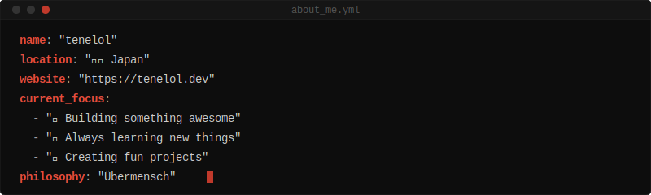
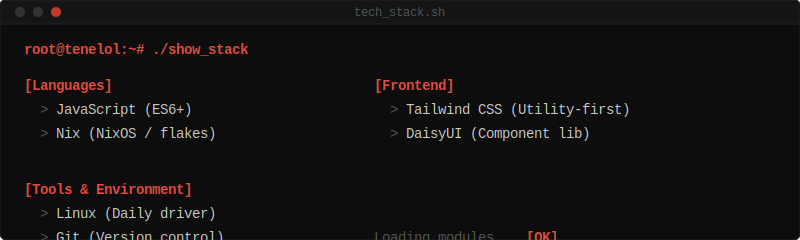

<!-- Custom banner -->

 

<!-- Social badges -->

## `> about_me`

  

## `> tech_stack`

  

<!--
## 🐍 Contribution Activity
(GitHub Actions の snake.yml を手動実行すると表示されます)

<picture>
  <source media="(prefers-color-scheme: dark)" srcset="https://raw.githubusercontent.com/tenelol/tenelol/output/github-contribution-grid-snake-dark.svg" />
  <source media="(prefers-color-scheme: light)" srcset="https://raw.githubusercontent.com/tenelol/tenelol/output/github-contribution-grid-snake.svg" />
  
</picture>

-->

