<!-- Custom banner -->

 

<!-- Social badges -->

**Full-stack engineer with a backend focus, exploring Nix, reliable tooling, and low-level systems.**

I build practical software with a focus on backend development, reproducible environments, and simple implementations that hold up in real use.

## `> profile`

- Full-stack engineer with a backend focus and a strong interest in Nix and developer tooling.
- Currently exploring lower-level systems while keeping day-to-day work grounded in practical backend engineering.
- I prefer clear architecture, reproducible setups, and maintainable code over unnecessary complexity.

## `> focus`

`Full-stack` `Backend Engineering` `Nix` `Low-level Systems`

## `> tech_stack`

**Core**

<!--
## 🐍 Contribution Activity
(GitHub Actions の snake.yml を手動実行すると表示されます)

<picture>
  <source media="(prefers-color-scheme: dark)" srcset="https://raw.githubusercontent.com/tenelol/tenelol/output/github-contribution-grid-snake-dark.svg" />
  <source media="(prefers-color-scheme: light)" srcset="https://raw.githubusercontent.com/tenelol/tenelol/output/github-contribution-grid-snake.svg" />
  
</picture>

-->

